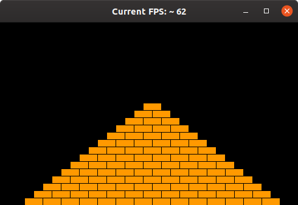

# U09 | Pyramide

Ihr Programm soll eine Pyramide zeichnen, die aus einzelnen Ziegeln besteht, die in horizontalen Linien angeordnet werden. Die Anzahl der einzelnen Blöcke nimmt um einen Block pro Reihe ab:

| Pyramide |
|:----:|
|  |

Die Pyramide soll am unteren Ende der Zeichenfläche stehen und in der Mitte zentriert werden. Verwenden Sie mindestens die folgenden Konstanten:

- `BRICK_WIDTH` für die Breite der Ziegel (30).

- `BRICK_HEIGHT` für die Höhe der Ziegel (12).

- `BRICKS_IN_BASE` für die Anzahl der Ziegel der untersten Reihe (14).

Die angegebenen Zahlen entsprechen der Pyramide auf dem Screenshot, aber Ihre Pyramide muss für unterschiedliche Werte korrekt funktionieren.

**Tipp zur Herangehensweise:** Versuchen Sie zuerst, einen Stapel aus einzelnen Ziegeln zu erzeugen. Modifizieren Sie diesen Code dann, um
eine Wand zu erzeugen (und denken Sie daran, die *Decomposition*-Methode anzuwenden). Anschließend modifizieren Sie diesen Code, so dass in jeder Reihe ein Ziegel mehr bzw. weniger gesetzt wird (je nachdem, ob Sie die Pyramide von oben oder von unten bauen). Zum Schluss müssen die einzelnen Ziegelreihen noch zentriert werden, d.h. Sie müssen den passenden Startpunkt für jede Reihe berechnen.
